# Gateway API Benchmarks - Part 2

This post represents "Part 2" of the original benchmarks done previously ([found here](./README.md)).
The testing done here is in additional to Part 1: it is highly recommended to read Part 1 first!

The goal of this post is to followup on the originally tested implementations to see how they have changed,
add additional implementations, and add additional tests.

*Disclaimer: Myself, and my employer, have associations and contributions to many of these projects (Istio, Envoy, Kgateway, Cilium, Agentgateway). While I have attempted to minimize bias in this report, any testing has some bias. I encourage you to reproduce the results yourself!*

* [Summary of findings](#summary-of-findings)
* [Added and removed implementations](#added-and-removed-implementations)
   + [HAProxy](#haproxy)
   + [APISIX](#apisix)
   + [Agentgateway](#agentgateway)
   + [Removed implementations](#removed-implementations)
* [Since last time](#since-last-time)
* [Tests](#tests)
   + [Attached Routes](#attached-routes)
   + [Route propagation time](#route-propagation-time)
   + [Route Changes](#route-changes)
   + [Route Scale](#route-scale)
   + [Traffic Performance](#traffic-performance)
   + [ListenerSet Scale](#listenerset-scale)
   + [Backend failover test](#backend-failover-test)
* [Conclusion](#conclusion)

## Summary of findings

Because this report is long, I'll start with the summarized results.
This section is entirely my subjective analysis of the results, so I would encourage you to draw your own conclusions!

|                      | Agentgateway           | Envoy Gateway                     | Istio                             | Nginx                             |
| -------------------- | ---------------------- | --------------------------------- | --------------------------------- | --------------------------------- |
| [Attached Routes Test](#attached-routes) | ✅                      | ⚠️ 10x more CPU usage than mean   | ✅                                 | ⚠️ Writes invalid status messages |
| [Route Propagation](#route-propagation-time)    | ✅ 20x faster than mean | ❌ HTTP Errors at all scales       | ✅                                 | ❌ Fails at scale                  |
| [Route Changes](#route-changes)        | ✅                      | ❌ HTTP Errors during changes      | ✅                                 | ❌ HTTP Errors during changes      |
| [Route Scale](#route-scale)          | 🥇 Best performer      | ⚠️ 108x more resource consumption | ⚠️ 44x more resource consumption  | ⚠️ 295x more resource consumption |
| [Traffic Performance](#traffic-performance)  | ✅ Good                 | ✅ Good                            | ✅ Good                            | ❌ 20x worse than mean             |
| [ListenerSet Scale](#listenerset-scale)    | 🥇 Best performer      | ⚠️ Unsupported                    | ⚠️ 6.8x more resource consumption | ⚠️ Unsupported                    |
| [Backend Failover](#backend-failover-test)     | [See results](#backend-failover-test)      | [See results](#backend-failover-test)                 | [See results](#backend-failover-test)                 | [See results](#backend-failover-test)                 |

## Since last time

Since the last report a short 3 months ago, many implementations have made some big changes!

**Nginx** releases a v2.0 re-architecture that appears to address some of the [architectural findings](./README.md#architecture-comparison), and have reached out to let me know some of the other issues in the original report have been fixed.

**Envoy Gateway** community [formally responded to the report](https://github.com/envoyproxy/gateway/discussions/6285#discussioncomment-13575356), denying many of the reported findings. There are a few claims to break down here:
* For the route change test, where Envoy Gateway saw downtime, they claim the issue is a ["fundamental issue around Envoy delta update"](https://github.com/envoyproxy/gateway/discussions/6285#discussioncomment-13579398). However, 4 Envoy-based implementations were tested; Envoy Gateway was the only implementation that had this, indicating that it is not a fundamental issue with Envoy, but rather a limitation found only in Envoy Gateway.
* For the architecture decision, where Envoy Gateway was marked as violating the Gateway API specification by placing resources in the incorrect namespace, they mentioned this was an intentional tradeoff to reduce the privileges required for deployment, and that they now [offer a mode](https://gateway.envoyproxy.io/docs/tasks/operations/gateway-namespace-mode/) to comply with the spec.
* The report showed a memory leak in the control plane, where memory quickly grew to 48 Gb. The claim is that the reported metric, `container_memory_working_set_bytes`, is not an appropriate measure of memory. This is not true; this metric is exactly what Kubernetes itself uses for memory limits, OOMKilling, etc, and is widely considered to be the source of truth for memory usage in Kubernetes ([1](https://faun.pub/how-much-is-too-much-the-linux-oomkiller-and-used-memory-d32186f29c9d), [2](https://docs.newrelic.com/whats-new/2021/03/kubernetes-whats-new/), [3](https://github.com/google/cadvisor/issues/2582)). Additionally, a reproduction shows the Go Heap *in use* memory, which cannot be reclaimed by the OS or GC, grows in correlation to the `container_memory_working_set_bytes` during the leak.
  * 

  * Further, they claim that memory is intentionally used, as a tradeoff, to reduce CPU. However, the Envoy Gateway control plane actually used 14.6x the CPU and 5.8x the memory of the top performing Envoy-based implementation, and 4.7x the CPU and 7.9x the memory of the second-best performing one ([source](./README.md#findings-2)), indicating the tradeoff may be ineffective.
  

**Cilium** community [created an issue to track follow-ups to the report](https://github.com/cilium/cilium/issues/39974) which has unfortunately been closed without any activity.

**Istio** community [made a PR](https://github.com/istio/istio/pull/56962) to improve the performance during high churn.

**Kgateway** community merged a few PRs to optimize performance ([[1]](https://github.com/kgateway-dev/kgateway/pull/11490), [[2]](https://github.com/kgateway-dev/kgateway/pull/11299)) and [enabled automated performance testing](https://github.com/kgateway-dev/kgateway/pull/11598) based on the methodology of this benchmark.

## Added and removed implementations

When I built out the test suite, I set a criteria for which implementations to include: they should *submit* conformance test results (even if they don't pass every test!) and be open source.
While I hoped to add a few more implementations to this test run, I struggled to find many that met the criteria

In fact, there was only one new implementation meeting this criteria: Agentgateway.

Despite this, there were multiple requests to include HAProxy and APISIX in the test last time.
During the first part, these were evaluated but not including due to only supporting the `alpha` API from 3 years ago.
Since some time has passed, and I continue to be asked about this, including by maintainers from the projects, its worth another look.

### HAProxy

HAProxy still only supports the [legacy API from years ago](https://github.com/haproxytech/kubernetes-ingress/blob/bd3d95792225c6fc677d3034a21d9b70931d6d51/go.mod#L30) so was not suitable for inclusion.
I am quite surprised by this given their team is stating they are [deprecating their existing controller in favor of Gateway API](https://www.reddit.com/r/kubernetes/comments/1l44d4y/comment/mw6jr2m/) and recommending users to migrate to the Gateway API.
Perhaps a future version will be useable and can be tested!

**Update 11/14/25:** HAProxy announced [updated Gateway API support](https://www.haproxy.com/blog/announcing-haproxy-unified-gateway-beta) a few days after I published this, so I decided to try it out.
Note: this is classified as "beta", so some rough edges are to be expected.

The setup phase was rough.
There is no Helm chart, so I followed their [example deployment](https://github.com/haproxytech/haproxy-unified-gateway/tree/dev/example/deploy/hug) of plain YAML.
However, this didn't work.
* The install doesn't install the required CRDs, which are undocumented and I only found with a few minutes of searching around the repo.
* The deployment points to an image that doesn't exist. I had to dig their the Docker Hub repo to find a working image.
* When creating a Gateway, its instantly marked as "Programmed" even when it wasn't. It wasn't programmed because I chose to bind to port 80, which it didn't have permissions to do.
* Once I manually added the permissions, I had to also manually update the Service to expose it.
* Even once fully setup, there is no Gateway address in the status, making most of the tests not work. Since I was curious, I changed some tests to manually hardcode the address which is why I was able to do a few tests.

HAProxy follows the [same problematic architecture as some others tested in the original report](./README.md#architecture-comparison): there is a single Deployment that contains the control plane and all instances of Gateways co-located in one pod. This violates the security and deployment model of Gateway API.

In the [Route Propagation test](./README.md#route-propagation-time), HAProxy takes 5s to propagate a route, compared to 5-100ms for leading implementations.

For the [traffic performance testing](./README.md#traffic-performance), HAProxy and Agentgateway were roughly comparable, usually within +/-10% of each other on each various test. However, I encountered issues with the HTTPRoute -- despite it being a valid route, with a valid status reported, the route got a 404. Only after adding some additional matchers to the route did it work at all.

In the [Route Scale test](./README.md#route-scale), HAProxy seemed to do pretty well, but its hard to judge due to two of the issues previously mentioned: they have a joint control plane and data plane (so we cannot isolate which of these is performing), and they throttle updates to every 5s which means we are trading off availability for resource consumption, which is not something the test measures.

Overall, its great to see another project moving to the Gateway API, but for now I think HAProxy is still a work in progress. I look forward to watching its progress.

### APISIX

APISIX looked promising, as the new 2.0 release includes modern support for Gateway API!
However, the code was immature enough that it could not complete *any* of the tests.
As such, I haven't included it in the broader tests, but will quickly run through the tests here so you don't have to take my word for it.

Setup:

```shell
helm upgrade --install apisix \
  --namespace apisix-system \
  --create-namespace \
  --set ingress-controller.enabled=true \
  --set ingress-controller.apisix.adminService.namespace=ingress-apisix \
  --set ingress-controller.gatewayProxy.createDefault=true \
  --repo https://apache.github.io/apisix-helm-chart \
  --version 2.11.6 \
  apisix
```

Configuration:
```yaml
apiVersion: gateway.networking.k8s.io/v1
kind: GatewayClass
metadata:
  name: apisix
spec:
  controllerName: "apisix.apache.org/apisix-ingress-controller"
---
apiVersion: gateway.networking.k8s.io/v1
kind: Gateway
metadata:
  name: apisix
  namespace: apisix
spec:
  gatewayClassName: apisix
  listeners:
  - protocol: HTTP
    port: 80
    name: http
    allowedRoutes:
      namespaces:
        from: All
```

First up, the [attached routes](./README.md#attached-routes) test fails to complete

```shell
$ ./tests/attached-routes.sh joined
2025-09-26T21:44:10.306986Z     info    Initial configuration: 1 namespaces, 100 applications, and 0 pods
^C
2025-09-26T21:44:34.689625Z     info    stopped controller=pods
2025-09-26T21:44:36.058369Z     error   failed to complete test name=apisix/apisix
```

The attached route status is not reported at all:
```
$ kubectl get gtw -o "custom-columns=NAME:.metadata.name,ATTACHED:.status.listeners[*].attachedRoutes" -n apisix
NAME     ATTACHED
apisix   0
```

Next up, the [route propagation time](./README.md#route-propagation-time) test also fails:

```bash
$ ./tests/probe.sh joined
2025-09-26T21:42:45.657773Z     info    Starting simulation with config:
Error: failed to run: gateway apisix/apisix has no address
```

Sure enough, the Gateway does not actually have an address set, making it unusable:
```shell
$ kubectl get gtw -n apisix
NAME     CLASS    ADDRESS   PROGRAMMED   AGE
apisix   apisix             True         43m
```

The [route change](./README.md#route-changes) test fails for the same reason.

We will continue to check in with APISIX in future iterations!

### Agentgateway

Agentgateway is a newer implementation that [claims](https://gateway-api.sigs.k8s.io/implementations/#agent-gateway-with-kgateway) to be specifically designed for Kubernetes Gateway API and to be "high performance and scalable"; we will see how it stands up compared to some of the incumbents!

### Removed implementations

In this iteration, I am no longer testing Cilium, Kong, or Traefik.

Nothing against these implementations, just each implementation brings some cost to test.
Kong and Traefik had incompatibilities that made it hard to run tests.
Cilium made testing challenging as it requires being the CNI.
Additionally, I didn't expect much interesting findings from these implementations as they haven't, to my knowledge, made major changes since the initial report.

Because Agentgateway utilizes Kgateway as the control plane (Kgateway can serve both Agentgateway or Envoy),
I have chosen not to include Kgateway-with-Envoy, as running both concurrently makes it hard to independently measure.

## Tests

Since we have some new implementations, and some major changes to others, it seems fitting to re-run the existing tests, then move onto new tests.

### Attached Routes

This test was somewhat less interesting than [last time](./README.md#attached-routes): all implementations tested had very similar patterns in terms of how they update the status.

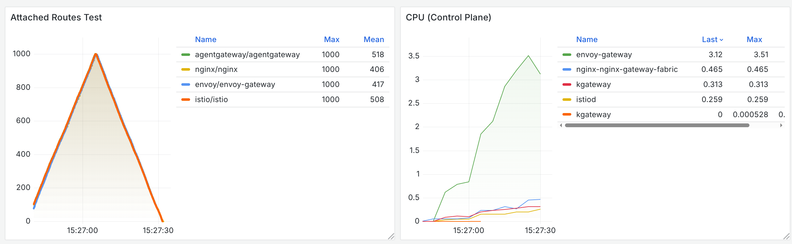

Two issues remain that were detected in the original report:
* Envoy Gateway continues to use 10x the CPU of other implementations for this test.
* Nginx Gateway continues to violate the spec by incorrectly writing invalid status entries. Below shows an audit entry of Nginx incorrectly writing status messages; the expectation is there is 1 entry per controller, for a total of 4, but Nginx inserts multiple entries.

  ```json
  {
    "time": "2025-09-26T22:35:13.916498Z",
    "verb": "update",
    "user": "system:serviceaccount:envoy-gateway-system:envoy-gateway",
    "gw": [
      "kgateway.dev/agentgateway",
      "gateway.envoyproxy.io/gatewayclass-controller",
      "istio.io/gateway-controller"
    ]
  }
  {
    "time": "2025-09-26T22:35:14.126110Z",
    "verb": "update",
    "user": "system:serviceaccount:nginx-system:nginx-nginx-gateway-fabric",
    "gw": [
      "gateway.nginx.org/nginx-gateway-controller",
      "kgateway.dev/agentgateway",
      "istio.io/gateway-controller",
      "gateway.envoyproxy.io/gatewayclass-controller",
      "kgateway.dev/agentgateway",
      "gateway.envoyproxy.io/gatewayclass-controller",
      "istio.io/gateway-controller"
    ]
  }
  ```

### Route propagation time

This test re-runs the [route propagation time](./README.md#route-propagation-time) test, creating new routes and waiting for them to become ready.

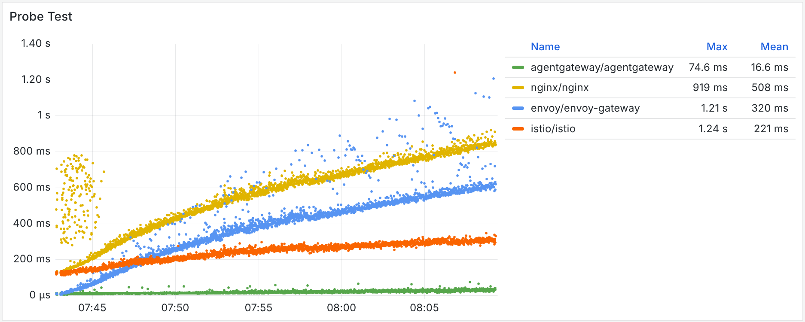

* Envoy Gateway and Nginx share a surprisingly similar curve, finishing at ~600ms and ~800ms respectively at 3000 routes. Nginx oddly has a huge amount of variance seen only at low route levels. Envoy Gateway has a variety of spikes throughout the test, but nothing too bad (the spikes are to roughly 2x the typical).
* Istio stays fairly steady throughout, remaining in the 120ms-300ms range throughout the test.
* Agentgateway remains consistently the fastest to propagate routes, with a tight range of 10-30ms throughout the test.

❌ Throughout the test, Envoy Gateway experience 14,808 errors (HTTP 503 error). The other 3 implementations had zero errors. In the real world, this means that new routing rules may show up as 503 errors to end users.

#### Route propagation v2

To make the test more interesting, I re-ran it but with a twist: it runs concurrently to the route scale test.
This ensures that implementations can quickly propagate new routes not only in an empty cluster, but in a real world scenario.

❌ Nginx was unable to propagate routes during this test entirely, taking over 5 minutes before timing out to propagate a single route. It has been excluded from the rest of testing.
During this time, any configuration changes I made to Nginx had no effect.

Below shows the results:

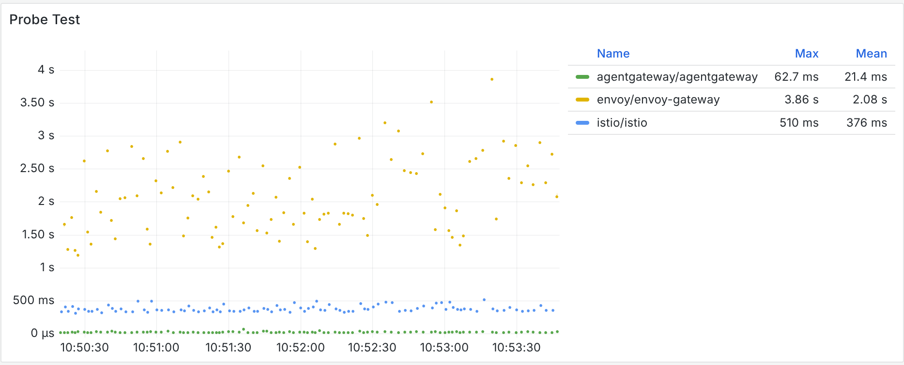

Only 100 routes were tested, as the implementations were already under load from the route scale test, so the added routes for the test were not relevant.

| Gateway       | Delay without load | Delay with load |
|---------------|--------------------|-----------------|
| Agentgateway  | 30ms               | 30ms            |
| Istio         | 300ms              | 375ms           |
| Envoy Gateway | 600ms              | 2000ms          |

Overall, Agentgateway shows no penalty under load, Istio shows a slight penalty, and Envoy Gateway is about 3x degraded under load.

### Route Changes

This test re-runs the [route changes](./README.md#route-changes) test, sending traffic while a route is modified. Downtime caused by a gateway implementation during a rollout will directly impact users, as these routes may be serving live traffic already.

| Gateway       | Result | Reason                       |
| ------------- | ------ | ---------------------------- |
| Agentgateway  | ✅     |                              |
| Istio         | ✅     |                              |
| Nginx         | ❌     | 500s during changes          |
| Envoy Gateway | ❌     | 503s during changes          |

The 3 incumbents behaved the same as in the previous testing, while Agentgateway passes the test without issues.

* Agentgateway, our new implementation under test, handles the test without errors.
* Istio continues to handle test the test without errors.
* Previously, Nginx failed due to crashlooping. This issue is resolved, but Nginx still returns errors during the changes.
* Envoy Gateway continues to emit errors during route changes.

### Route Scale

This test re-runs the [route scale](./README.md#route-scale) test, creating 5,000 routes total and measuring resource consumption.

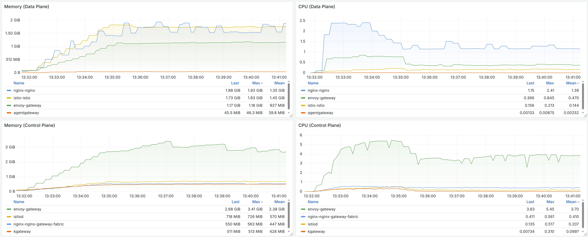

This shows some interesting findings:
* Agentgateway absolutely dominates this test.
  * While other dataplanes *start* at 60-90MB RAM, and grow to 1-2GB RAM, agentgateway starts at only 4MB RAM and completes the test at 40MB RAM - a 25-50x improvement!
  * Similarly, the CPU usage remains below 1%, with other implementations ranging from 20-240%.
* Unlike the first test, Nginx v2.0 has a split control plane and data plane architecture, allowing for apples-to-apples comparisons. This allows us to see that while the Nginx control plane is performing relatively well, the data plane is a bit more resource heavy than other implementations.
* Envoy Gateway continues to struggle to scale up to large scales, using 10x the CPU and memory of all other control planes.

Since the Envoy Gateway numbers skew the results a bit, I wanted to zoom in on the control plane CPU:

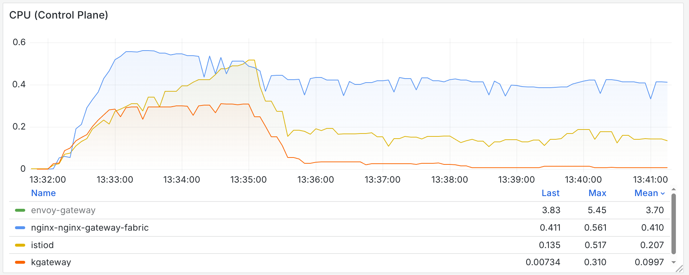

While these 3 implementations use a similar amount of resources during the initial fast scale-up, once we hit steady state (where pods and configurations are constantly changing) Istio uses 4x the CPU of Agentgateway, Nginx uses 9x the CPU of Agentgateway, and Envoy Gateway uses 82x the CPU of Agentgateway.
This state more closely resembles real world usage, where its less typical to rapidly deploy thousands of routes, but is very common to have pods scale up and down.

Because all 4 control planes happen to be written in Go, we can compare the Go garbage collection metrics to get some more insights:

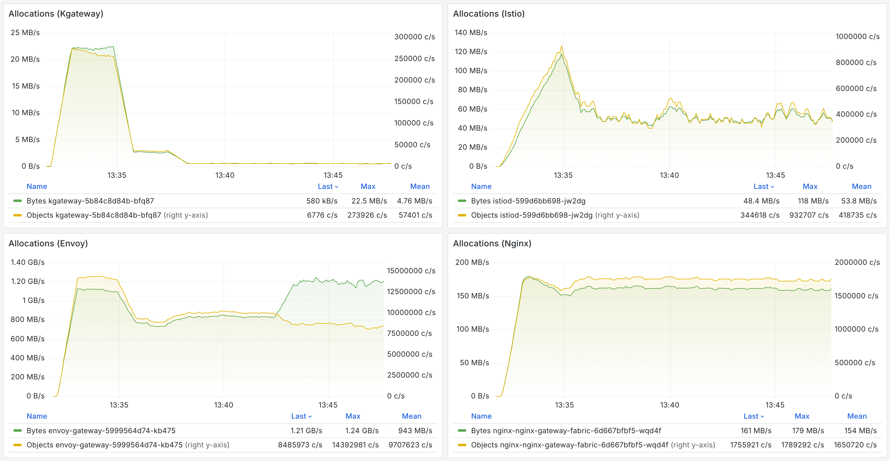

These results vary even more and explain some of the other CPU and memory numbers - each implementation has wildly different allocation patterns. At steady state, Envoy Gateway is allocating 10,000,000 objects per second compared to only 6,000 from Agentgateway, and allocates over 2,000x more memory!

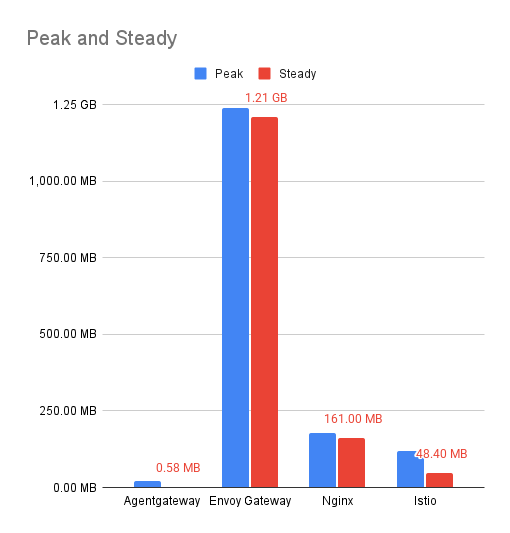

Given there are a ton of graphs and measurements flowing around this test, I thought it would be interesting to try to summarize it down to a single number for comparison. I came up with a fairly arbitrary scoring that each implementation is compared with their performance, relative to the best in that category, and weighted 80% for the data plane and 20% for the control plane (this weight was intended to match real world scenarios, where they are many more replicas of the data plane than the control plane).

For instance, if the best implemented used 500mb of memory and another used 1.5GB, the scores would be `1` and `0.33`.

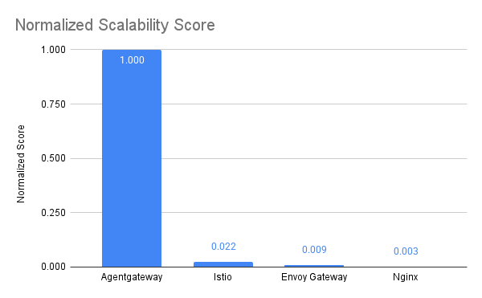

Put another way, relative to Agentgateway, Istio uses 44x more resources, Envoy Gateway uses 108x more resources, and Nginx uses 295x more resources.

### Traffic Performance

This test runs the [traffic performance](./README.md#traffic-performance) test from the original test. Its worth repeating that performance benchmarking of traffic is very hard, and not something this test suite focuses on. The goal of this test is only to identify major outliers in performance; more focused data plane testing will require more efforts.

First up we measure maximum throughput as number of connections increases:

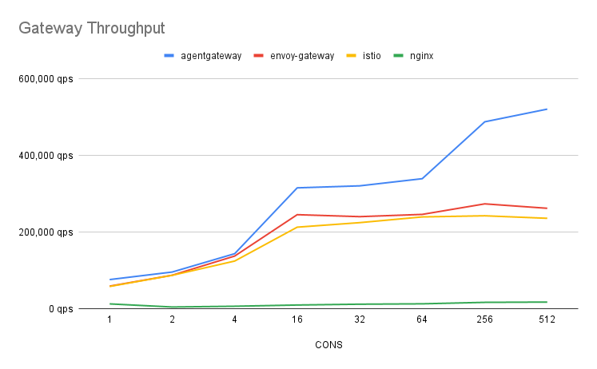

As seen last time, Nginx's default of not pooling connections makes the out-of-the-box performance quite poor.
The rest of the implementations show good performance, with agentgateway pulling away as the number of connections increases.

The next test runs a fixed 30k QPS and records P99 latency. As nginx could not sustain 30k QPS, it was excluded:

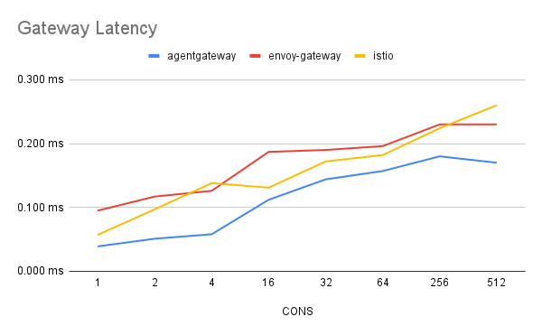

Overall, aside from Nginx due to its lack of connection pooling, all three implementations show strong traffic performance.

### ListenerSet Scale

In the [route scale](#route-scale) test, we created lots of HTTP routes.
However, in many cases users have lots of different HTTPS *domains*.

Gateway API newly supports this use case with the `XListenerSet` API; the `X` is for "experimental.
Unfortunately, only two of the implementations (Agentgateway and Istio) currently support this API, so the test is focused only on these two.

To run the test: `./tests/listenerset-load.sh <namespace count> <listenerset per namespace>`.
I ran with 50 namespaces; each namespace has 50 ListenerSets, each with 16 routes. So a total of 2,500 ListenerSets and 40,000 routes.

The results:

> [!NOTE]
> While all implementations are included here, only Agentgateway and Istio are under load.
> Any utilization from Envoy Gateway or Nginx is work done processing irrelevant resources.

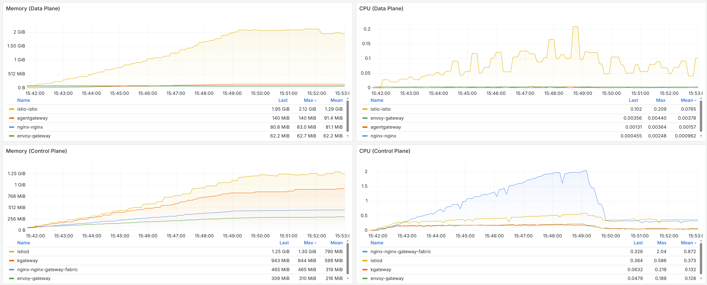
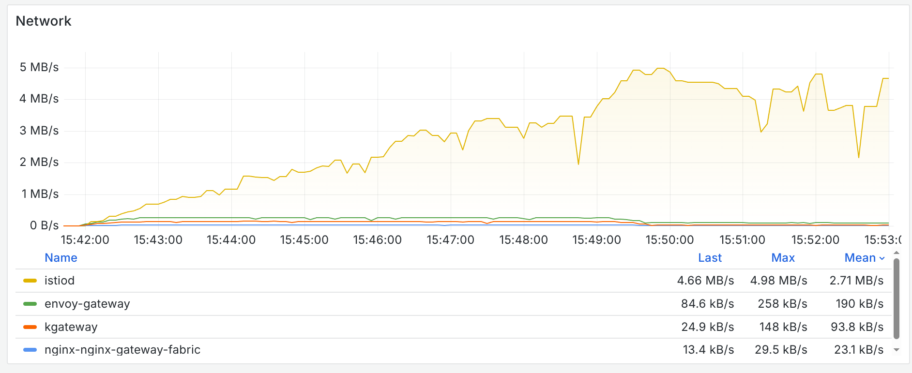

The results here are fairly similar to the route scale test, but utilization all around is a bit higher than the route test.
This is expected, as there is a lot more resources involved here: 40,000 routes compared to 5,000, not to mention the additional listeners.

Istio data plane uses 15x the memory and 50x the CPU of Agentgateway to handle the load, while the control planes are much closer.
Istio control plane uses 1.3x the memory, 2.8x the CPU, and 30x the network bandwidth relative to Agentgateway.

Interestingly, Nginx and Envoy Gateway are pretty heavily loaded here, despite having no configuration impacting them. Nginx actually uses the most CPU of any implementation, peaking at 10x more than Agentgateway, and Envoy Gateway is nearly identical to Agentgateway consumption. Zooming in on the data plane (hiding Istio's usage, which skews the results) shows Agentgateway actually using similar or less resources than the inactive Envoy Gateway and Nginx instances!

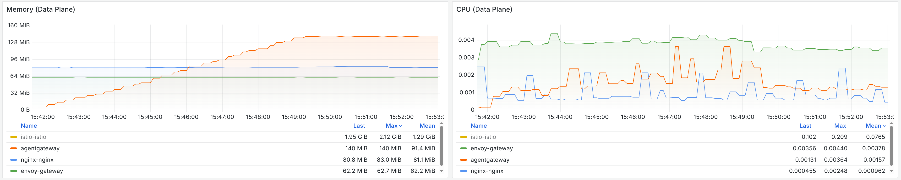

As other implementations pick up support for XListenerSet, I look forward to including them in future tests!

### Backend failover test

In this test, the goal is to understand how different gateways handle temporary outages for particular backends.
To test this, we create a Service with a few pods that are always healthy, and one that flips between health and unhealthy.
The number of requests sent to the changing pod is analyzed.
To make the traffic patterns not too simplified, different routes are hit on each request.

To reproduce this test, run `./tests/backendfailover.sh`.

A perfect implementation would send zero requests to the backend while it was unhealthy, and then immediately start sending traffic again once its healthy.
However, there are a variety of tradeoffs that come with implementing this.
Generally, we need to send a request (which will fail) in order to detect the backend is unhealthy, and send a request (which succeeds) to detect it is healthy.
If we mark a backend as "unhealthy" and never send requests to it again, we may reduce failures but will not utilize the backend at all when it is healthy.
However, if we poll it too frequently, we will unnecessarily get failures!

For the initial run, we get the following results:

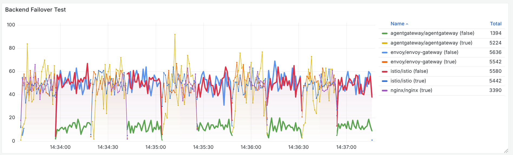

The graph is a bit noisy so warrants some explanation. Each line represents requests to the flip-flopping endpoint. The bolded lines are errors (when the backend is unhealthy), while the thin lines are successes.

In this initial graph, we see:
* Envoy Gateway and Istio behave the same. They maintain a consistent request rate during success and failover. That is, there is no special handling of failed traffic at all.
* Nginx sees no failures at all. This is actually because it is not implementing the `HTTPRoute` specification, and ignoring the `retry.attempts=0` I set! In addition, Nginx is by-default configured to evict endpoints for 10s if they fail. Combined with retries, this means we only attempt the failed backend once every 10s, and the retry transparently masks the failure.
* Agentgateway sees some errors, but at a lower rate than the others - about 25%. This is due to agentgateway's default load balancing algorithm, which favors healthy endpoints over unhealthy endpoints. 

#### With retries

I initially disabled retries explicitly since I figured it made this test not very meaningful; I would expect little-to-no errors with retries enabled, but in the real world constantly retrying is detrimental (but hard to measure here, as many implementations don't give visibility into retries).

In order to verify this, I re-ran the test with retries enabled:

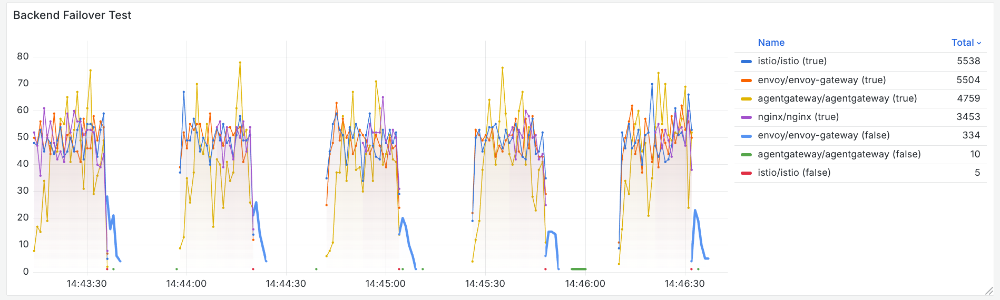

While this dropped Agentgateway and Istio down to (near) zero failures, for some reason Envoy Gateway experienced errors during the initial transition. I am not sure why (if you are, drop a note in the issues)!
As mentioned, testing with retries isn't very interesting, so I have disabled retries for the remaining tests (except Nginx, which is not possible).

#### With outlier detection

For the next variant, I wanted to test the implementation-specific policies that are available to tune this.
Both Istio and Envoy Gateway offer control over *evicting* unhealthy endpoints based on some criteria.
This works similarly to the Nginx on-by-default functionality; once an endpoint hits the criteria, it will be excluded for some number of seconds.

The config for these is nearly identical, except Envoy Gateway attaches to the Gateway while Istio attaches to the Service:

```yaml
apiVersion: networking.istio.io/v1
kind: DestinationRule
metadata:
  name: outlier
  namespace: default
spec:
  host: backend
  trafficPolicy:
    outlierDetection:
      baseEjectionTime: 10s
      consecutive5xxErrors: 5
      consecutiveGatewayErrors: 5
      consecutiveLocalOriginFailures: 5
      maxEjectionPercent: 100
      splitExternalLocalOriginErrors: true
---
apiVersion: gateway.envoyproxy.io/v1alpha1
kind: BackendTrafficPolicy
metadata:
  name: outlier
  namespace: envoy
spec:
  targetRefs:
    - group: gateway.networking.k8s.io
      kind: Gateway
      name: envoy-gateway
  healthCheck:
    passive:
      baseEjectionTime: 10s
      consecutive5XxErrors: 5
      consecutiveGatewayErrors: 5
      consecutiveLocalOriginFailures: 5
      maxEjectionPercent: 100
      splitExternalLocalOriginErrors: true
    panicThreshold: 0
```

Agentgateway does not currently offer similar configuration (and Nginx, as noted, has it enabled but unconfigurable), so only Istio and Envoy Gateway are changed.

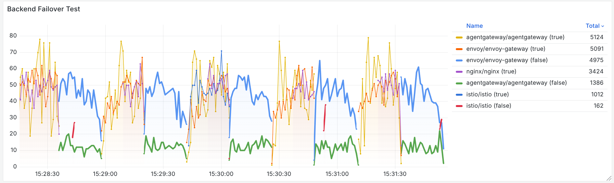

Here we see some interesting results! To showcase them better I will zoom in.

")

Aside from Agentgateway, which has no changes from the previous test, each implementation exhibits something interesting here.

* While Nginx doesn't show any errors, due to ~cheating~ retries, there is a long delay where it isn't sending any requests once the backend is healthy.
  This actually happens on all of the tests, but is hard to notice when not zoomed in. This relates to whether the fixed interval to re-check an unhealthy endpoint has become healthy aligns well, or not, with when the endpoint becomes healthy.
* In Istio, we see very few requests to the backend (healthy or otherwise). I believe this is from a similar cause as Nginx, where the eviction intervals are so long that we end up never recovering fast enough to send healthy requests.
* Despite being configured extremely similar to Istio (which is configuring the same underlying Envoy configuration), Envoy Gateway sees substantially more errors - essentially no different than without the `healthCheck` configured. I believe this is due to differences in how the two implementations arrange the configuration for Envoy; while Istio makes 1 Envoy `cluster` (think of this as a set of endpoints with load balancing and health configuration) per `Service`, Envoy Gateway creates one per `HTTPRoute` backend. This means the health information is not unified between each request, so we are unable to effectively trigger the health check policy. Instead of needing 5 consecutive errors, we need `5*routes` consecutive errors. This means the more distinct routes we have (for example `/home` vs `/shopping-cart`), the less effective our traffic policies will be.

#### With active health checks

Envoy Gateway has another type of health check, an "active" health check.
Rather than observing requests and acting on their results, the gateway probes the backend outside of the request flow (similar to Kubernetes health probes).

This is configured on the same `BackendTrafficPolicy`:

```yaml
active:
  http:
    path: /healthz
    expectedStatuses: [200]
  healthyThreshold: 1
  unhealthyThreshold: 1
  interval: 1s
  timeout: 1s
  type: HTTP
```

With this policy in place, the initial errors we saw with Envoy Gateway go away.

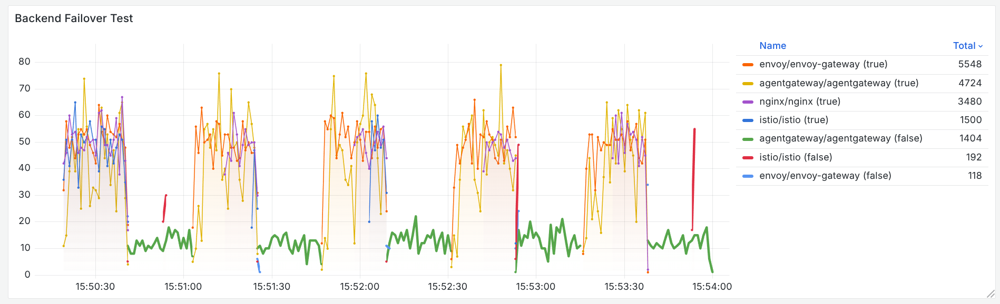

However, this policy comes at a cost. Unlike Kubernetes probes, which would operate on a per-pod basis, Envoy Gateway's operates on a per route-backend basis.
Like with the passive health checks, this means as we add more routing rules for a given backend, the load to the backend increases.
In this small setup, I had each Envoy instance sending 1,000 requests per second on health check traffic (and using 5% of CPU time to do this).


## Conclusion

If you made it this far, thank you! Feel free to go back to the [summary of findings](#summary-of-findings) to recap.

Have any comments, suggestions, etc? Feel free to reach out in an [issue](https://github.com/howardjohn/gateway-api-bench/issues)!
