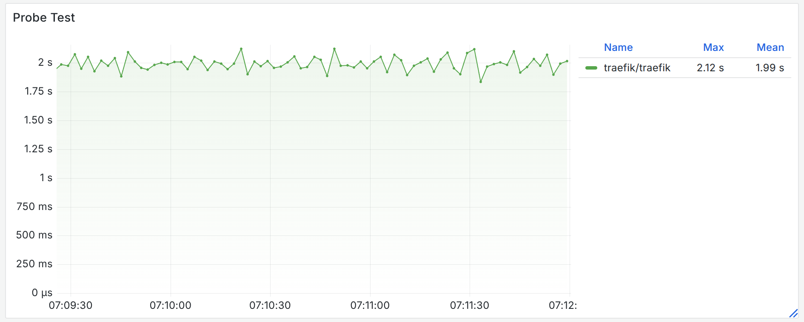

# Gateway API Benchmarks

The Kubernetes [Gateway API](https://gateway-api.sigs.k8s.io/) aims to be the next-generation networking API for Kubernetes,
replacing the older [Ingress API](https://kubernetes.io/docs/concepts/services-networking/ingress/).

Like Ingress, it comes with a number of different implementations of the API.
These implementations have **wildly** different behaviors, strengths, and weaknesses that are not caught by the [conformance tests](https://gateway-api.sigs.k8s.io/implementations/v1.3/).
Aside from the tests only covering the basics, most implementations do not report conformance test results at all, and most of the implementations that do report a result skip over half of the tests!

This repo aims to provide a comprehensive test suite that goes far beyond the conformance tests, to help users better understand the real-world behavior of implementations.

*Disclaimer: Myself, and my employer, have associations and contributions to many of these projects (Istio, Envoy, Kgateway, Cilium). While I have attempted to minimize bias in this report, any testing has some bias. I encourage you to reproduce the results yourself!*

- [Overview](#overview)
- [Summary of findings](#summary-of-findings)
- [Architecture Comparison](#architecture-comparison)
- [Tests](#tests)
   * [Common Test Setup](#common-test-setup)
   * [Attached Routes](#attached-routes)
      + [Independently](#independently)
      + [Simultaneously](#simultaneously)
      + [Findings](#findings)
   * [Route propagation time](#route-propagation-time)
      + [Findings](#findings-1)
   * [Route Changes](#route-changes)
   * [Route Scale](#route-scale)
      + [Findings](#findings-2)
   * [Traffic Performance](#traffic-performance)
      + [Findings](#findings-3)

# Overview

This test suite aims to cover any active, free, platform-agnostic (i.e. not a cloud vendor) implementation.

|                                       | Cilium                    | Envoy Gateway           | Istio        | Kgateway                | Kong                 | Traefik                 | Nginx              |
|---------------------------------------|---------------------------|-------------------------|--------------|-------------------------|----------------------|-------------------------|--------------------|
| Open Source                           | ✅                         | ✅                       | ✅            | ✅                       | ❌ Since 3.10         | ✅                       | ✅                  |
| Open Source Foundation                | CNCF                      | CNCF                    | CNCF         | CNCF                    | No foundation        | No foundation           | No foundation      |
| Enterprise Vendors (offering support) | Single Vendor (Isovalent) | Single Vendor (Tetrate) | Many vendors | Single Vendor (solo.io) | Single Vendor (Kong) | Single Vendor (Traefik) | Single Vendor (F5) |
| Dataplane Proxy                       | Envoy                     | Envoy                   | Envoy        | Envoy                   | Nginx                | Traefik                 | Nginx              |
| Tested Version                        | v1.17.2                   | v1.4.0                  | v1.26.0      | v2.0.1                  | v3.9                 | v35.3.0                 | v1.6.2             |

> [!TIP]  
> All projects under test utilize a proxy that has usage beyond Kubernetes/Gateway API.
> Its important to recognize that a high quality proxy does not, on its own, make a high quality Gateway API implementation.
> In the following tests, we will show even implementations that share the same proxy can have wildly different behaviors.

The rationale for some notable exclusions:
* HAProxy: no release in 3 years, does not support the current API.
* APISIX: no release in 2 years, does not support the current API.
* Tyk: transitioned to a closed source, paid model in 2024.
* Linkerd: only supports mesh, not ingress use cases which this test focuses on.
* Higress: no Gateway API support.

# Summary of findings

Because this report is long, I'll start with the summarized results.
This section is entirely my subjective analysis of the results, so I would encourage you to draw your own conclusions!

|                                             | Cilium                        | Envoy Gateway      | Istio | Kgateway | Kong                         | Traefik                      | Nginx                 |
|---------------------------------------------|-------------------------------|--------------------|-------|----------|------------------------------|------------------------------|-----------------------|
| [Attached Routes Test](#attached-routes)    | ✅                             | ⚠️ Errors with other broken implementations | ✅     | ✅        | ❌ Errors                     | ❌ Errors                     | ❌ Errors              |
| [Route Probe Test](#route-propagation-time) | ✅                            | ❌ Errors           | ✅    | ✅       | ✅                           | ✅                           | ✅                    |
| [Route Scale Test](#route-scale)            | ❌ Hard limit on scale         | ❌ Leaks memory     | ✅     | ✅        | ✅                            | ❌ Falls apart                | ✅                    |
| [Traffic Performance](#traffic-performance) | ❌ Bottlenecked to single core | ✅                  | ✅     | ✅        | ⚠️ Degradation at high scale | ⚠️ Degradation at high scale | ❌ 20x worse than mean |
| [Architecture](#architecture-comparison)    | ⚠️                            | ⚠️                 | ✅     | ✅        | ❌ Severe issues              | ❌ Severe issues              | ⚠️                    |

Traefik:
* 🚨🚨🚨 Traefik consolidates all Gateways, even in different namespaces, onto a single shared component.
  This merging is not only risk from a security and operational standpoint, but it is implemented in a manner such that any namespace can modify or collide with another namespaces configuration (in violation of the specification). ([source](#architecture-comparison))
* 🚨🚨🚨 When a new Traefik instance starts, it starts recieving traffic before it has applied its configuration.
  The time to apply configuration can be extremely large (see below). ([source](#route-scale))
* 🚨🚨 Traefik cannot handle large scales of routes, and completely fails to apply them. ([source](#route-scale))
* ⚠️ Traefik occasionally reported incorrect status messages which never recovered. ([source](#attached-routes))
* ⚠️ If a route points to Traefik and another Gateway, Traefik will attempt to infinitely remove the other's status. ([source](#attached-routes))
* ⚠️ While Traefik has competitive traffic performance at small scales, it is unable to scale up to serve as much traffic as other implementations. ([source](#traffic-performance))

Nginx:
* 🚨 Nginx may crash while processing valid HTTPRoutes. ([source](#route-changes))
* 🚨 Nginx throughput is 20x worse than the median implementation. ([source](#traffic-performance))
* ⚠️ Nginx does not have a separation of control plane and data plane which can be a reliability risk at high scale.
* ⚠️ Nginx only supports a single Gateway instance.
* ⚠️ If a route points to Nginx and another Gateway, Nginx will attempt to infinitely remove the other's status. ([source](#attached-routes))
* ⚠️ Nginx uses substantial CPU resources to process Gateways/Routes that are not targeted at Nginx.

Cilium:
* 🚨 After the generated Envoy configuration reaches 1.5mb (etcd limits), the proxy configuration is unable to be updated. Configurations cannot be added, removed, or updated. This happens silently without any feedback to the user. ([source](#route-propagation-time))
* 🚨 During route updates, there is a temporary downtime. ([source](#route-changes))
* 🚨 Cilium throughput is unable to scale up with multiple connections, leading to up to 20x worse performance than the median implementation in some cases. ([source](#traffic-performance))
* 🚨 Cilium repeatedly got into states where all traffic to a node was dropped, recovering only by restarting Envoy. ([source](#traffic-performance))
* ⚠️ At large scales, Cilium control plane uses excessive CPU (over 15x the top performing implementation). ([source](#route-scale))
* ⚠️ Cilium uses a single shared Envoy instance (per node) for all Gateways in the cluster. This represents a risk of noisy neighbor issues and confused deputy attacks when operating in a multi-tenant environment. ([source](#architecture-comparison))
* ℹ️ At large scales, Cilium data plane generates excessive timeseries entries (by default) that may degrade performance. ([source](#route-scale))

Envoy Gateway:
* 🚨 During route updates, there is a temporary downtime for traffic. ([source](#route-changes))
* 🚨 During changes to routes, Envoy Gateway's control plane leaks memory. ([source](#route-scale))
* ⚠️ At large scales, Envoy Gateway control plane uses excessive CPU (15x the top performing implementation). ([source](#route-scale))
* ⚠️ When a new route is added, initial requests to the route will get errors. ([source](#route-propagation-time))
* ⚠️ Envoy Gateway deploys all resources, even from other namespaces, into a single shared namespace. This represents an operational and security risk, and violates the upstream specification. ([source](#architecture-comparison))
* ℹ️ At large scales, Envoy Gateway data plane generates excessive timeseries entries (by default) that may degrade performance. ([source](#route-scale))

Kong:
* 🚨🚨🚨 Kong consolidates all Gateways, even in different namespaces, onto a single shared component.
  This merging is not only risk from a security and operational standpoint, but it is implemented in a manner such that any namespace can modify or collide with another namespaces configuration (in violation of the specification). ([source](#architecture-comparison))
* ⚠️ Kong occasionally reported incorrect status messages which never recovered. ([source](#attached-routes))
* ⚠️ If a route points to Kong and another Gateway, Kong will attempt to infinitely remove the other's status. ([source](#attached-routes))
* ⚠️ While Kong has competitive traffic performance at small scales, it is unable to scale up to serve as much traffic as other implementations. ([source](#traffic-performance))
* ⚠️ Kong uses non-trivial CPU resources to process Gateways/Routes that are not targeted at Nginx.

Istio:
* ✅ No issues were found.

Kgateway:
* ℹ️ At large scales, Kgateway data plane generates excessive timeseries entries (by default) that may degrade performance. ([source](#route-scale))


# Architecture Comparison

The architecture of the project is critical to its success in a real world environment. There are a variety of distinct architectures used by the implementations under tests.

The optimal architecture has a few aspects:
* The control plane (which reads configuration and programs the underlying proxy) is split from the data plane. This is a [widely established best practice](https://docs.aws.amazon.com/whitepapers/latest/aws-fault-isolation-boundaries/control-planes-and-data-planes.html) to optimize for reliability and scale.
* The data plane must run in the same namespace as the `Gateway` object. This avoids privilege violations where a lower privilege namespace can create resources in privileged namespaces. Additionally, this ensures the ability to distinguish traffic from different `Gateway` instances (for usages such as `NetworkPolicy` and others).

These properties are *almost required* by the specification by [GEP 1762](https://gateway-api.sigs.k8s.io/geps/gep-1762), though Cilium has a unique architecture that meets the requirements as well (see below)

This architecture typically looks like this:


This approach is implemented in Istio and Kgateway.
---

A few implementations take different approaches.
The first variation is deploying the gateway instances in a shared namespace.
This violates namespace boundaries and introduces security risks: any namespace (with `Gateway` creation privilege) can spin up a service and deployment in the system namespace, and send arbitrary traffic from this namespace.

As noted above, this violates the specification which states:
> an implementation MUST provision generated resources in the same namespace as the Gateway if they are namespace scoped resources.

This approach is taken by Envoy Gateway.


---

Finally, there are architectures that are entirely shared - no matter how many `Gateway` resources there are, they are all served by a single shared proxy deployment.

This has some variations in each implementation:

* Traefik and Nginx have a single Deployment and Service for all Gateway instances, and the control plane is embedded in this deployment as well.
  * Traefik does not properly isolate these, in violation of the specification.
    Two distinct Gateways in different namespaces can collide with each other and effect routing.
    **This makes Traefik unsafe for usage with multiple Gateways**.
    Additionally, Traefik does not support dynamic ports.
  * Nginx does not support multiple Gateways at all and will reject any after the first.
* Kong has the control plane split out, but uses a single Deployment and Service for all Gateway instances.
  Like Traefik, these are not properly isolated in violation of the spec. **This makes Kong unsafe for usage with multiple Gateways**.
* Cilium deploys a Service-per-Gateway, in the Gateway namespace, but serves traffic from a single proxy DaemonSet. Cilium has 3 components: A per-node Envoy DaemonSet (data plane), a per-cluster Operator Deployment (control plane), and a per-node Cilium Agent DaemonSet (this blurs the line between control plane and data plane; for our purposes we categorize it as data plane). Because the only generated resources live in the Gateway namespace, and Cilium's unique architecture allows multiple Services from distinct namespaces to all be sent to the same data plane instance, this meets the requirements of the API. However, overloading all Gateways cluster-wide into a single data plane deployment does introduce risks.

Below shows an example of a shared architecture with a split controller; some have only a single Deployment.


---

In summary:

|                                | Cilium          | Envoy Gateway                 | Istio | Kgateway | Kong               | Traefik            | Nginx                  |
|--------------------------------|-----------------|-------------------------------|-------|----------|--------------------|--------------------|------------------------|
| Dataplane/Controlplane Split   | ⚠️ <sup>1</sup> | ✅                             | ✅     | ✅        | ✅                  | ❌                  | ❌ <sup>2</sup> |
| Gateway instances split        | ❌               | ✅                             | ✅     | ✅        | ❌                  | ❌                  | ❌                      |
| Dataplane in Gateway namespace | ❌               | ❌                             | ✅     | ✅        | ❌                  | ❌                  | ❌                      |
| GatewayClass pre-created       | ✅               | ❌                             | ✅     | ✅        | ❌                  | ✅                  | ✅                      |
| Spec complaint architecture    | ✅               | ❌ Namespace boundaries broken <sup>3</sup> | ✅     | ✅        | ❌ Major violations | ❌ Major violations | ⚠️ Single Gateway only |

<sup>1</sup>: `cilium-agent` is a control plane component but is involved in serving traffic.

<sup>2</sup>: The [NGINX Gateway Fabric 2.0](https://community.f5.com/kb/technicalarticles/announcing-f5-nginx-gateway-fabric-2-0-0-with-a-new-distributed-architecture/341657) release was shipped around the time of publishing this, splitting the control and data plane.
However, this comparison is still using version 1.6. A followup will test version 2.0.

<sup>3</sup>: Envoy Gateway recently released a [Namespace Mode](https://gateway.envoyproxy.io/docs/tasks/operations/gateway-namespace-mode/) that can deploy the resources in the correct namespace, which may fix this issue.
This feature was not evaluated as it was released after the comparison was done, is off-by-default, and is "alpha". A followup comparison will evaluate this mode.

# Tests

We will run a variety of distinct scenarios against each implementation.

A single HTTPRoute may be attached to many Gateway's simultaneously.
This is often utilized to run tests concurrently to all implementations.
However, some implementations do not support this (in violation of the specification) so are excluded from these tests.
When excluded, they will be called out in the test section.

## Common Test Setup

The test environment deploys a Grafana, Prometheus, and VictoriaLogs instance for monitoring.
Then, each implementation is deployed along with a `Gateway` for it.

This can all be setup by running `./install/basic.sh`.

The results on this post are run using a single node `kind` cluster on a 16-core AMD 9950x CPU with 96GB RAM.
Note that while this type of environment may be unrealistic for *traffic tests* (such as max QPS and latency), which are
typically much more appropriate to run in similar hardware to real world usage, most tests here are not sensitive to variations in hardware.
Using a single node cluster helps minimize noise (from implementations getting different results based on which others are co-scheduled, for example).
Additionally, Cilium deploys some components as DaemonSets, so a single node helps normalize those to a single instance.

The recommended installation steps:

```shell
# Must be done BEFORE Cilium install
kubectl apply -f https://github.com/kubernetes-sigs/gateway-api/releases/download/v1.3.0/standard-install.yaml
cilium install -f cilium.yaml
./install/basic.sh
```

The [Grafana dashboard](dashboard.json) can be imported for visualizing the test results.

## Attached Routes

The `Gateway` object has an interesting `status` message, `attachedRoutes` which is supposed to store a count of the total successfully attached route objects.

In this test, we create a bunch of routes and investigate how this status field is updated.

This test is interesting not so much because `attachedRoutes` is critical for day to day operations, but that it gives a lot of insight into how the controller is implemented.

To reproduce this test, run `./tests/attached-routes.sh [split|joined] --routes=1000`.
This can run all implementations concurrently (`joined`) or separately (`split`). 

### Independently

First, we will run the test for each implementation one-by-one.

The *Setup time* is the time *after the last route is created* until the `attachedRoutes` is updated to the total route count.
In this test, I created 1000 routes.

Once the setup is complete, all routes are removed and we wait for the count to go back to 0.

The *Teardown time* is the time after the last route is deleted until the status is reset back to zero.

*Total writes* indicates how many distinct times the status field was updated. This shows how some implementations make many updates, while others batch them up.

|                                | Cilium | Envoy Gateway | Istio | Kgateway | Kong | Traefik | Nginx |
| ------------------------------ | ------ | ------------- | ----- | -------- | ---- | ------- | ----- |
| Setup time                     | 1s     | 23s           | 2s    | 12s      | 1s   | 180s    | 29s   |
| Teardown time                  | 18s    | 45s           | 20s   | 16s      | 22s  | 16s     | 15s   |
| Total Writes                   | 193    | 1383          | 311   | 323      | 1403 | 73      | 82    |


> [!CAUTION]
> **Kong** and **Traefik** both reported incorrect results. Both reported more routes than there were, and occasionally got into scenarios where the `attachedRoute` field was was non-zero when there were no routes.

### Simultaneously

This test is the same as before, but instead of creating 1000 routes with 1 gateway reference each, we create 1000 routes with a gateway references to each implementation.


|                                | Cilium | Envoy Gateway | Istio | Kgateway | Nginx |
| ------------------------------ | ------ | ------------- | ----- | -------- | ----- |
| Setup time                     | 1s     | 10s           | 2s    | 17s      | 17s   |
| Teardown time                  | 27s    | 45s           | 27s   | 28s      | 28s   |
| Total Writes                   | 243    | 1484          | 73    | 15       | 128   |


This test revealed a number of implementation issues with the interaction between implementations.

**Nginx** was found to behave improperly.
Below shows the audit log showing Nginx duplicating status entries; there should be 1 entry per controller, but Nginx writes duplicates.
```json
{
  "user": "system:serviceaccount:istio-system:istiod",
  "gw": [
    "gateway.nginx.org/nginx-gateway-controller",
    "kgateway.dev/kgateway",
    "istio.io/gateway-controller",
    "gateway.envoyproxy.io/gatewayclass-controller"
  ]
}
{
  "user": "system:serviceaccount:nginx-system:nginx-nginx-gateway-fabric",
  "gw": [
    "gateway.nginx.org/nginx-gateway-controller",
    "gateway.envoyproxy.io/gatewayclass-controller",
    "istio.io/gateway-controller",
    "kgateway.dev/kgateway",
    "kgateway.dev/kgateway",
    "istio.io/gateway-controller",
    "gateway.envoyproxy.io/gatewayclass-controller"
  ]
}
```

**Traefik** was found to behave improperly.
Each controller should write a status message for their own reference.
Instead, Traefik writes one for each parent -- even parents pointing to other Gateways.
This additionally poorly interacts with **Envoy Gateway**.
When Envoy Gateway sees a status entry for it's parent from Traefik, it takes it over.
As a result, we have the following sequence:
```json
{
  "user": "system:serviceaccount:envoy-gateway-system:envoy-gateway",
  "gw": [
    "gateway.envoyproxy.io/gatewayclass-controller"
  ]
}
{
  "user": "system:serviceaccount:traefik-system:traefik",
  "gw": [
    "traefik.io/gateway-controller",
    "traefik.io/gateway-controller",
    "gateway.envoyproxy.io/gatewayclass-controller"
  ]
}
{
  "user": "system:serviceaccount:envoy-gateway-system:envoy-gateway",
  "gw": [
    "traefik.io/gateway-controller",
    "gateway.envoyproxy.io/gatewayclass-controller",
    "gateway.envoyproxy.io/gatewayclass-controller"
  ]
}
{
  "user": "system:serviceaccount:traefik-system:traefik",
  "gw": [
    "traefik.io/gateway-controller",
    "traefik.io/gateway-controller",
    "gateway.envoyproxy.io/gatewayclass-controller",
    "gateway.envoyproxy.io/gatewayclass-controller"
  ]
}
```
First, Traefik writes a duplicate status entry.
Then, Envoy Gateway takes over the duplicate entry.
This causes Traefik to create another duplicate, which Envoy Gateway will also take over.
This occurs indefinitely, and eventually the object will have thousands of invalid status entries.

These results were found from the Kubernetes Audit log, processed with command: `jq 'select(.verb != "list") | select(.responseObject.code != 409) | {time: .requestReceivedTimestamp, verb: .verb, user: .user.username, gw: [.responseObject.status.parents?[]?.controllerName]}'`


### Findings

* Traefik and Kong have bugs in their implementations that can lead to them reporting invalid status.
* Nginx, Traefik, and Envoy Gateway all have poor interactions with other implementations leading to invalid status messages.
* Traefik stands out as by far the slowest implementation.
* Cilium, Istio, and Kong show the fastest update times (each roughly the same).
* Kgateway, Envoy, and Nginx (in that order) trail behind a bit, but have pretty reasonable results.
* While all implementations have a spike in CPU during their turn, Nginx consistently spikes in CPU when *unrelated controllers* are running. This indicates it is unable to ignore (from a performance perspective) configurations that are not intended for it. Kong shows similar behavior but to a lesser extent.
* In terms of *number* of writes, we see a few differences. Envoy and Kong tend to write a lot, while the others write less frequently (differing slightly depending on the scenario). There is no true "best" value here; writing too often may lead to excessive costs, while not writing enough may lead to low responsiveness.
  However, this is not necessarily directly correlated. While Kong writes a lot, it also has very fast response times. In contrast, Envoy writes a lot but is on the slower side.
* Looking at the graphs also gives some interesting insights.
  * Envoy speeds up at the end of setup, and slows down at the end of teardown. I would **guess** this has to do with favoring updates to the HTTPRoutes themselves during the slow times.
  * In contrast, Kgateway tends to initially write fast then slow down towards the end of setup (tear down, however, remains fast).

## Route propagation time

In this test, we apply a route and wait for it to be ready in the data plane.
This is done by sending requests to it until it transitions from returning `404` to `200`.

The test runs 3000 routes. A new route is added after the previous route is completed, and the time until a request successfully returns 200 is recorded.

To reproduce this test, run `./tests/probe.sh [split|joined] --routes=3000`.
This can run all implementations concurrently (`joined`) or separately (`split`).

First we plot the results:


Additionally, the CPU and memory utilization is tracked during the test:


Finally, the total latency and number of errors is tracked. An error is any status code other than a 404 or 200 that is returned. A new route is expected to transition from 404 to 200 without any errors.


Due to Kong and Traefik being slow, they were excluded from above and run individually. Both show similar results of a fairly static, but high, latency. 




### Findings

Looking at the control plane and data plane resource utilization during the test gives some additional insights:
* Nginx and Envoy Gateway data planes both scale up memory usage as more routes are added. (Note: nginx control and data plane are co-located so cannot be viewed independently).
* All control planes scale up memory usage as more routes are added.
* CPU usage for both data plane and control plane remains mostly flat for all implementations, with Envoy Gateway data plane increasing slightly as more routes are added.
  * Cilium uses by far the most CPU, followed by Nginx and Envoy, then Kgateway and Istio which are about the same. Cilium's control plane use 7.5x the CPU of Istio, and Envoy Gateway uses 2.9x.
* Both Kong and Traefik have very consistently (slow) times, at 3s and 2s respectively.

While Cilium behaves reasonably at lower route scales, it has complete failure once the route size gets too large.
After a certain threshold of total size of Envoy configuration is passed, Cilium is unable to update the proxy **at all**.
This includes adding new routes, but also changing existing configuration.
When this happens, there is no feedback to the user; routes are reported as "ready" in the status even when they will never become ready.

Both Cilium and Envoy encounter errors during the test, while all others complete with zero errors.
Cilium's errors, however, only occur during the very first route creation, likely indicating the Gateway is not fully setup until the first route attaches.
In practice, this is unlikely to have any production impact.
Envoy's, however, occur throughout the test, giving errors on nearly every single route, total to 15,000 failed requests through the test.

## Route Changes

In this test, traffic is continually sent to a gateway while a route is modified.
This one has no pretty graphs -- an implementation passes if they return 100% `200`s and fails if they return any errors.

To reproduce this test, run `./tests/routechange.sh --iterations=20`.

3 of 7 implementations fail to safely update a route with zero downtime:

| Gateway       | Result | Reason                       |
| ------------- | ------ | ---------------------------- |
| Kgateway      | ✅     |                              |
| Istio         | ✅     |                              |
| Traefik       | ✅     |                              |
| Kong          | ✅     |                              |
| Nginx         | ❌     | Crashloop during changes     |
| Envoy Gateway | ❌     | 503s and 500s during changes |
| Cilium        | ❌     | 503s during changes          |

This can be a fatal error in production.
While the [route propagation test](#route-propagation-time) measures *new routes*, which may not be as critical, changing a route is a routine operation during progressive rollouts and other operations.
Downtime caused by a gateway implementation during a rollout will directly impact users, as these routes may be serving live traffic already.

## Route Scale

In this test, a large number of routes, services, and pods are created.
Once the initial set of resources is created, a resource is modified (such as editing an HTTPRoute, or adding/removing a Pod).
The resource utilization of the gateway control and data planes is recorded.
Note that tests up until now have been creating large number of HTTPRoutes, but all pointing to a single backend; this test has many backends.

To reproduce this test, run `./tests/route-load.sh <namespace count> <routes per namespace>`.

To simulate a large cluster, we run with 50 namespaces with 100 routes each (5,000 routes total):


During my testing, I was surprised to find Envoy Gateway and kgateway *data planes* using so much CPU.
After some investigation, I found this was caused by the high number of metrics emitted by these proxies, along with an aggressive 5s scraping interval used in the test.

|Dataplane|Timeseries Created|
|-|-|
|Istio|557|
|Cilium|341,778|
|Envoy Gateway|852,418|
|Kgateway|1,710,982|

(While Cilium also generates a relatively high number of metrics, the test Prometheus instance wasn't configured to scrape it).

To isolate the metrics load from the rest of the test, I reran the test with Prometheus scraping disabled for each Gateway.
Additionally, I took the opportunity to `sum` the two Cilium components, and hide Nginx from the data plane section (it's mixed control plane and data plane architecture skews the results).


In the test above, Envoy Gateway appears to leak, but its hard to say conclusively without running a longer test.
A 30 minute execution reveals unbounded memory leaks; even after the test was stopped (the vertical blue line), the memory is not freed.


Initial testing of Traefik (standalone, due to bugs with co-existing with other implementations) initially appears to be one of the best performing control planes:


However, this turned out to be too good to be true.
Traefik appears to be highly performant because its **not actually processing the routes at all**!
Traefik consistently only processed a subset of the routes -- as few as 10% -- leaving the rest entirely ignored. This was verified through Traefik's internal API (`/api/http/routers`) and dashboard, the HTTPRoute status, and sending requests through Traefik.
Even worse, the routes that *do* get applied are lost on the next reboot while they are being processed again. Traefik marks itself 'Ready' during this time, meaning scaling up/restart Traefik can lead to previously working routes failing.

> [!NOTE]
> A future addition to the test suite will run the [route propagation time test](#route-propagation-time) against implementations at this scale.
> Quick testing of other implementations reveals this may be a common area of issues for implementations; Nginx revealed up to 15s of delay time during the scale test while under lower scales was always sub-second.

Finally, Kong was run standalone due to previous issues with running alongside other implementations:


### Findings

All data planes use a relatively large amount of RAM, ranging from 1GB to 1.8GB but remaining constant through the churn.
The data plane CPU is also fairly similar, ranging from 200m to 450m.

On the control plane side, however, we see a huge variance.
Comparing the best performer in RAM and CPU to the others shows a wide spread:

| Gateway       | Relative CPU Consumption | Relative Memory Usage |
| ------------- | ------------------------ | --------------------- |
| Istio         | 1.0x                     | 1.5x                  |
| Kong          | 3.1x                     | 1.1x                  |
| Nginx         | 5.2x                     | 3.0x                  |
| Kgateway      | 6.6x                     | 6.2x                  |
| Envoy Gateway | 14.6x                    | 8.7x (leaking)        |
| Cilium        | 16.4x                    | 1.0x                  |

As noted above, there were a few implementations with critical issues:
* Envoy Gateway leaks memory; in just 15 minutes the memory usage grew to 45GB while other implementations remained constant.
* Traefik cannot handle large number of routes at all and is unsafe to run at scale. In particular, any new instances may go many minutes before they start serving correct data!

## Traffic Performance

Aside from the control plane aspects, possibly the most critical aspect of a gateway is how it handles traffic.
However, analyzing data plane performance is a notoriously tricky task.
This can depend on thousands of variables that may vary between users environments.
Additionally, often testing a highly synthetic setup will not reproduce to the real world.

As such, I will not be doing a fine-grained analysis of each implementation.
Instead, we will consider an implementation to be "sufficiently performant" if its performance is within the ballpark of others, and just analyze outliers.

To reproduce this test, run `./tests/traffic.sh -d <duration> -q <qps> -c <connections> -p <payload size>`.
A `qps` of `0` will attempt to send as much traffic as possible.
This will run a load generator against each implementation in turn with the configured parameters.

I ran the test through a variety of scenarios, some looking at maximum throughput and others latency.


Additionally, we also analyze the CPU utilization with 1024 connections and a fixed 10k QPS:


<details>
<summary>Raw Data</summary>

```
DEST           QPS     CONS  DUR  PAYLOAD  THROUGHPUT    P50       P90       P99
istio          0       1     30   0        29079.91qps   0.034ms   0.039ms   0.054ms
kgateway       0       1     30   0        36793.86qps   0.028ms   0.030ms   0.043ms
envoy-gateway  0       1     30   0        34491.46qps   0.028ms   0.033ms   0.045ms
cilium         0       1     30   0        20161.59qps   0.045ms   0.060ms   0.118ms
nginx          0       1     30   0        1729.08qps    0.549ms   1.677ms   1.998ms
traefik        0       1     30   0        29845.99qps   0.031ms   0.038ms   0.080ms
kong           0       1     30   0        37481.98qps   0.024ms   0.032ms   0.063ms
istio          15000   1     10   0        14998.28qps   0.034ms   0.044ms   0.098ms
kgateway       15000   1     10   0        14998.28qps   0.028ms   0.036ms   0.089ms
envoy-gateway  15000   1     10   0        14999.23qps   0.029ms   0.038ms   0.089ms
cilium         15000   1     10   0        9308.51qps    0.088ms   0.171ms   0.291ms
nginx          15000   1     10   0        4443.72qps    0.119ms   0.592ms   0.696ms
traefik        15000   1     10   0        14998.27qps   0.033ms   0.044ms   0.096ms
kong           15000   1     10   0        14998.19qps   0.026ms   0.038ms   0.077ms
istio          0       16    10   0        130207.82qps  0.114ms   0.180ms   0.264ms
kgateway       0       16    10   0        170469.20qps  0.085ms   0.144ms   0.227ms
envoy-gateway  0       16    10   0        138551.00qps  0.107ms   0.174ms   0.257ms
cilium         0       16    10   0        19258.45qps   0.756ms   1.628ms   2.283ms
nginx          0       16    10   0        33641.28qps   0.188ms   1.579ms   3.216ms
traefik        0       16    10   0        136693.31qps  0.105ms   0.167ms   0.343ms
kong           0       16    10   0        130052.86qps  0.113ms   0.174ms   0.364ms
istio          15000   16    10   0        14998.26qps   0.099ms   0.172ms   0.272ms
kgateway       15000   16    10   0        14998.34qps   0.091ms   0.148ms   0.230ms
envoy-gateway  15000   16    10   0        14998.01qps   0.094ms   0.156ms   0.248ms
cilium         15000   16    10   0        14998.17qps   0.207ms   0.462ms   1.571ms
nginx          15000   16    10   0        10797.45qps   0.154ms   2.599ms   6.694ms
traefik        15000   16    10   0        14997.66qps   0.097ms   0.152ms   0.280ms
kong           15000   16    10   0        14997.49qps   0.121ms   0.199ms   0.399ms
istio          100000  16    10   0        99994.19qps   0.097ms   0.182ms   0.283ms
kgateway       100000  16    10   0        99997.92qps   0.046ms   0.119ms   0.225ms
envoy-gateway  100000  16    10   0        99997.30qps   0.071ms   0.155ms   0.243ms
cilium         100000  16    10   0        20049.95qps   0.711ms   1.593ms   1.993ms
nginx          100000  16    10   0        31803.72qps   0.186ms   1.642ms   3.428ms
traefik        100000  16    10   0        99994.40qps   0.085ms   0.163ms   0.348ms
kong           100000  16    10   0        99424.88qps   0.129ms   0.196ms   0.413ms
istio          50000   16    10   4096     49997.86qps   0.066ms   0.111ms   0.230ms
kgateway       50000   16    10   4096     49998.15qps   0.043ms   0.064ms   0.148ms
envoy-gateway  50000   16    10   4096     49997.98qps   0.048ms   0.082ms   0.183ms
cilium         50000   16    10   4096     18528.44qps   0.768ms   1.682ms   2.381ms
nginx          50000   16    10   4096     27099.19qps   0.185ms   1.073ms   4.509ms
traefik        50000   16    10   4096     49995.43qps   0.055ms   0.135ms   0.416ms
kong           50000   16    10   4096     49997.96qps   0.034ms   0.141ms   0.491ms
istio          0       512   10   0        328168.60qps  1.518ms   2.645ms   3.793ms
kgateway       0       512   10   0        400687.22qps  1.215ms   2.254ms   3.575ms
envoy-gateway  0       512   10   0        325149.12qps  1.487ms   2.787ms   4.219ms
cilium         0       512   10   0        22098.60qps   23.147ms  32.489ms  46.874ms
nginx          0       512   10   0        91579.69qps   4.481ms   9.789ms   24.955ms
traefik        0       512   10   0        217669.76qps  0.323ms   6.831ms   17.076ms
kong           0       512   10   0        104350.24qps  4.480ms   7.335ms   16.449ms
```

</details>

### Findings

For most tests, there was a general grouping of implementations seeing similar results.
However, there were a few outliers.

**Nginx** stands out as having performance 5-20x worse than other implementations in every test, both in throughput and CPU utilization.
Some analysis of this found this was due to not pooling upstream connections (or at least, not efficiently),
meaning each HTTP request must create a new TCP connection.
In contrast, every other implementation would re-use the same TCP connections throughout the test.
Interestingly, Cilium also plays a role here; because Cilium requires being the cluster CNI in order to use it as a Gateway,
my cluster setup naturally uses Cilium as the CNI.
Cilium does additional work during TCP connection establishment, leading to a spike in Cilium CPU when Nginx receives traffic:


However, this is *not* the cause of Nginx's poor performance; testing on clusters without Cilium reveal similar results.

**Cilium** additionally sees poor performance.
When handling only a single connection the results aren't too bad, achieving about 66% as much throughput as the typical implementation, Cilium is unable to scale up to serve multiple connections.
While other Envoy-based implementations are able to achieve 4x throughput with 16 connections and 10x throughput with 512 connections, Cilium's throughput remains consistent at all connection counts.
At 512 connections, this leads to a 20x performance gap between Cilium and Kgateway (despite both using the same Envoy data plane).

**Kong** sees competitive performance results up until the number of connections exceeds the core count of the node.
At this point, performance fails to continue to scale up.
In contrast, the Envoy-based implementations continue to scale beyond 16 connections (the test was run on a 16 core machine). 

**Traefik** shows similar performance to the Envoy-based implementations at smaller scales, but isn't able to scale up to high core counts as effectively.
Like Kong, Traefik is unable to scale up beyond a certain connection count.
However, this seems to occur at 32 connections (1 connection per *thread*) compared to Kong which gets limited at 16 connections (1 connection per *core*).
This is likely due to Traefik using 32 processes (via `GOMAXPROCS` auto-detecting thread counts) while Nginx using 16 processes.

The rest of the implementations (Istio, Envoy Gateway, and Kgateway) are generally fairly consistent.
However, at very high loads Kgateway pulls ahead slightly, achieving 25% greater throughput at 512 connections compare to Envoy Gateway and Istio.


